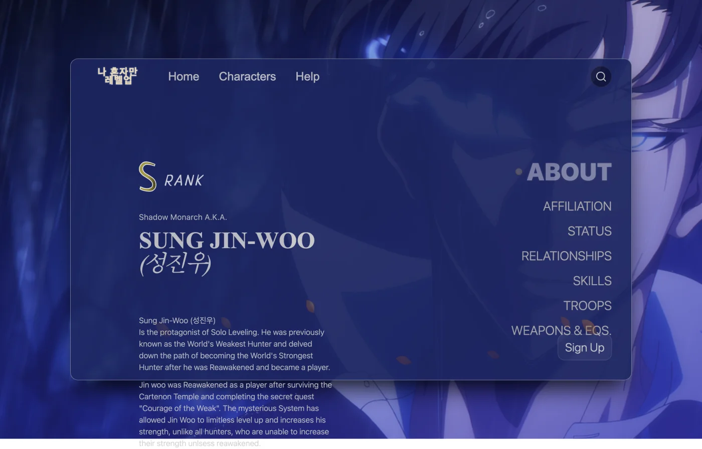

# Solo Leveling FP

Enciclopedia dedicata a *Solo Leveling*: schede dei personaggi con rango, affiliazione,
relazioni, abilità ed equipaggiamento, con ricerca fra i personaggi.

Online: **[sololeveling.fun](https://sololeveling.fun)**

**Stack:** React · Vite · Tailwind CSS · React Router · Supabase (auth) · lucide-react

## L'area utente

C'è registrazione e accesso con Supabase Auth, e una tabella `profiles` col nome utente.
Per ora l'account serve a una cosa sola: farsi riconoscere e salutare per nome nella home.

Le funzioni per gli utenti registrati — preferiti, note sui personaggi — sono la prossima cosa.

## Le rotte e il server

È una single page application: React Router gestisce le rotte nel browser. Quando però si
ricarica una sottopagina, il browser chiede quel percorso **al server**, che non ha nessun
file lì e risponde 404.

Per questo la repo contiene due file che dicono la stessa cosa a due host diversi:

- **`vercel.json`** — per il deploy su Vercel
- **`public/.htaccess`** — per l'hosting Apache/LiteSpeed dove punta il dominio

Entrambi mandano qualsiasi percorso non esistente su `index.html`.

## Farlo girare

    npm install
    npm run dev

Variabili d'ambiente:

    VITE_SUPABASE_URL
    VITE_SUPABASE_ANON_KEY
